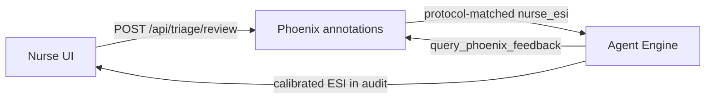

# ClinTrace

**Action-taking ED triage agent with full Phoenix traceability and nurse-in-the-loop learning**

ClinTrace  runs a **directed clinical workflow** (parse → assess → route → Phoenix feedback → audit), emits **structured actions** for nurses (routing orders, red-flag alerts, ESI, human-review flags), and logs every step to **Arize Phoenix**. Nurses can **approve or override** decisions in the UI; overrides become **trace annotations** that recalibrate confidence and ESI on **clinically similar** future cases — without retraining the model.

Built for the [Google Cloud Rapid Agent Hackathon](https://rapid-agent.devpost.com/) — **Arize / Phoenix track**.

**Repository:** [github.com/Reuben-Alex/ClinTrace](https://github.com/Reuben-Alex/ClinTrace)

---

## What the agent does

Given free-text nursing intake (symptoms, vitals, history), ClinTrace:

1. **Parses** the presentation into structured JSON (chief complaint, symptoms, vitals, history).
2. **Assesses acuity** — ESI level (1–5), confidence, reasoning, and red-flag screening (STEMI, stroke, sepsis, etc.) in a merged LLM step by default.
3. **Routes** the patient (ED destination, priority, consults, ETA).
4. **Queries Phoenix** for nurse overrides on **similar** prior cases and may **recalibrate ESI** and confidence when complaint-matched history exists.
5. **Produces** a **CLINTRACE TRIAGE AUDIT REPORT** plus structured **action cards** for the UI (routing order, alerts, human-review recommendation, Phoenix insight).

Every LLM step is traced in Phoenix. The UI links each run to its trace and lets a nurse **approve or override ESI** with an optional clinical note; that annotation feeds the next similar case.

### Production layout (deployed)

```
Nurse browser
     │
     ▼
Cloud Run — clinictrace-ui (FastAPI)
     │  stream_query()
     ▼
Vertex AI Agent Engine — clintrace_agent pipeline
     │  OTLP + REST
     ├──► Arize Phoenix Cloud (traces, annotations, feedback lookup)
     └──► Remote Phoenix MCP on Cloud Run (optional tool spans)

Cloud Run UI also reads NHAMCS cases from BigQuery for the test lab.
```

| Service | Role |
|---------|------|
| **Cloud Run UI** | Intake form, triage report, nurse oversight, Phoenix deep links |
| **Agent Engine** | ADK workflow + Gemini on Vertex (`gemini-3.5-flash`, global) |
| **Phoenix Cloud** | Traces, span annotations, nurse override storage, similarity search |
| **Phoenix MCP (Cloud Run)** | Streamable HTTP MCP for demo-visible tool calls |
| **BigQuery** | NHAMCS test-lab cases (`clinictrace.ed_triage`) |

Local dev runs the same pipeline in-process (`InMemoryRunner`) when `AGENT_ENGINE_RESOURCE_ID` is unset.

---

## Architecture

### Default pipeline (`MERGE_TRIAGE_LLM_STEPS=true`)

Fewer LLM round-trips: severity + red flags are merged, audit report is built deterministically from session state.

```
Patient intake (natural language)
         │
         ▼
┌──────────────────────────────────────────────────────────────┐
│  ADK 2.x Workflow (clintrace_agent)                           │
├──────────────────────────────────────────────────────────────┤
│  1. symptom_parser        → parsed_symptoms                   │
│  2. clinical_assessor     → severity + red_flags (merged)   │
│  3. expand_clinical       → severity_score, red_flags keys    │
│  4. specialist_router     → routing                           │
│  5. enforce_routing       → routing guardrails                │
│  6. feedback_agent        → feedback_analysis (Phoenix REST)  │
│  7. deterministic_audit   → audit_report                      │
└──────────────────────────────────────────────────────────────┘
         │
         ├──► action_composer → UI action cards
         └──► OpenTelemetry → Phoenix Cloud
```

Alternate graph (set `MERGE_TRIAGE_LLM_STEPS=false`): parallel `severity_scorer` + `red_flag_detector` → `JoinNode` → … → LLM `audit_reporter`.

### Feedback loop



1. **Write** — Nurse override → `ground_truth_eval` annotation (`under_triage` / `over_triage`) with `nurse_esi`, `agent_esi`, short `chief_complaint`, `symptom_keywords`, and optional `nurse_note`.
2. **Match** — `query_phoenix_feedback` (Phoenix REST) finds similar traces, then `feedback_matching.py` decides whether each override applies. With **`FAST_TRIAGE=true`** (production default), this is **deterministic Python** — not an extra LLM call.
3. **Apply** — When a complaint-matched override exists and match quality is high enough, `feedback_agent` sets `calibrated_esi`, `esi_calibration_applied`, and adjusted confidence; the audit report and UI action cards reflect the correction.

#### Protocol-aligned similarity matching

Overrides are **not** matched diagnosis-by-diagnosis. They use **ED triage protocol buckets** inspired by the **Manchester Triage System (MTS)** presenting-complaint flows, plus common **US ED activation pathways** (ACS/STEMI, stroke, trauma, sepsis, etc.):

| Protocol family | Examples |
|-----------------|----------|
| `cardiovascular` | Chest pain, ACS, palpitations |
| `trauma_injury` | Head/neck injury, laceration, MVC |
| `neurological` | Stroke, seizure, headache, syncope |
| `respiratory` | Dyspnea, asthma, cough |
| `toxicology` | Alcohol, overdose, intoxication |
| … | GI, GU, mental health, infectious, allergic, etc. |

**Three gates** must pass before an override influences a run:

| Gate | Rule |
|------|------|
| **Complaint similarity** | Keyword / chief-complaint overlap (stricter **0.55** threshold for weak `annotation_metadata` scans; **0.34** for span-based matches) |
| **Protocol family** | Current case and override must share an MTS-style family (blocks e.g. cardiovascular STEMI history on a trauma head-injury case) |
| **Pathway markers** | Nurse notes implying ACS/cath lab, code stroke, trauma team, sepsis bundle, etc. must align with the current case’s protocol family |

**ESI calibration** is allowed only from **high-trust** span matches (`attribute_chief_complaint` or `keyword_overlap`). Metadata-only matches may affect confidence counts but **do not change ESI**.

Implementation: `clintrace_agent/feedback_matching.py` + `clintrace_agent/tools/phoenix_history.py`. The `phoenix-similarity-matching` skill documents the same rules for the optional slow LLM feedback path (`FAST_TRIAGE=false`).

### ADK Skills

Domain instructions live in `clintrace_agent/skills/*/SKILL.md`. With **`INLINE_SKILLS=true`** (default), skill bodies are embedded in prompts — no extra `load_skill` turn per agent.

| Skill | Used by |
|-------|---------|
| `clinical-intake-parser` | Symptom parser |
| `esi-severity-scoring` | Severity / clinical assessor |
| `red-flag-screening` | Red-flag detection |
| `ed-specialist-routing` | Specialist router |
| `triage-audit-report` | Audit reporter (non-merged path) |
| `phoenix-feedback-loop` | LLM feedback path only (`FAST_TRIAGE=false`) |
| `phoenix-similarity-matching` | Documented rules; **enforced in code** via `feedback_matching.py` when `FAST_TRIAGE=true` |

---

## Tech stack

| Layer | Technology |
|-------|------------|
| Orchestration | Google **ADK 2.x** `Workflow`, optional `JoinNode` |
| Reasoning | **Gemini 3.5 Flash** on Vertex (`CLINICTRACE_VERTEX_LOCATION=global`) |
| Agent runtime | **Vertex AI Agent Engine** (production) or local ADK runner |
| Observability | **Arize Phoenix Cloud**, OpenInference (ADK + optional MCP) |
| Feedback | Phoenix **REST** (`query_phoenix_feedback`) + optional **Phoenix MCP** |
| UI | **FastAPI** on **Cloud Run**, Jinja templates, nurse oversight API |
| Validation | **NHAMCS** (CDC public-use ED data), optional **BigQuery** |
| Deploy | `make deploy-all` → Phoenix MCP + Agent Engine + UI |

---

## Quick start

### Prerequisites

- Python 3.11+
- Google Cloud project with Vertex AI + (optional) BigQuery
- [Arize Phoenix Cloud](https://app.phoenix.arize.com) account
- Node.js 20+ only if using local Phoenix MCP via `npx`

### Setup

```bash
git clone https://github.com/Reuben-Alex/ClinTrace.git
cd ClinTrace
python -m venv .venv
source .venv/bin/activate
pip install -e ".[dev,verification,gcp]"
cp .env.example .env
# Edit .env: GOOGLE_PROJECT_ID, PHOENIX_*, optional AGENT_ENGINE_RESOURCE_ID
gcloud auth application-default login
```

### Run locally

```bash
make ui          # http://localhost:8080 — intake, NHAMCS lab, nurse review
make run         # CLI single case
make test        # unit tests (no live APIs)
make verify      # NHAMCS batch (50 cases)
```

### Deploy to GCP

```bash
make phoenix-mcp-secrets   # once: Secret Manager for Phoenix + MCP keys
make deploy-all            # Phoenix MCP → Agent Engine → Cloud Run UI
```

Or individually: `make deploy-phoenix-mcp`, `make deploy-agent`, `make deploy-ui`.

After `deploy-agent`, set `AGENT_ENGINE_RESOURCE_ID` in `.env` (also written to `deployment_metadata.json`). The UI uses it to call Agent Engine via `stream_query`.

---

## Environment variables

| Variable | Purpose |
|----------|---------|
| `GOOGLE_PROJECT_ID` | GCP project (Vertex + BigQuery) |
| `GOOGLE_GENAI_USE_VERTEXAI` | Use Vertex ADC (default `true`) |
| `CLINICTRACE_VERTEX_LOCATION` | Gemini region (`global` for 3.5 Flash) |
| `CLINICTRACE_MODEL` | Pipeline model (default `gemini-3.5-flash`) |
| `PHOENIX_API_KEY`, `PHOENIX_COLLECTOR_ENDPOINT` | Trace export + REST client |
| `PHOENIX_PROJECT_NAME`, `PHOENIX_PROJECT_ID` | Phoenix project + API paths |
| `AGENT_ENGINE_RESOURCE_ID` | Full Reasoning Engine resource name |
| `AGENT_ENGINE_REGION` | Agent Engine region (`us-central1`) |
| `PHOENIX_MCP_URL` | Remote MCP on Cloud Run (`…/mcp`) |
| `FAST_TRIAGE` | `true` = deterministic Phoenix REST feedback (default) |
| `MERGE_TRIAGE_LLM_STEPS` | `true` = merged assess + deterministic audit (default) |
| `INLINE_SKILLS` | `true` = inline skill markdown (default) |
| `BQ_NHAMCS_TABLE` | BigQuery table for NHAMCS test lab |

See [.env.example](.env.example) for the full list.

---

## UI features

- **Manual intake** — free-text case → triage report, action cards, Phoenix link.
- **NHAMCS Test Lab** — random real U.S. ED visits (BigQuery or local Stata); compare agent ESI to nurse immediacy.
- **Nurse oversight** — approve agent ESI or submit override (1–5) + optional note; logged to Phoenix for the feedback loop.
- **Quality banner** — optional LLM-as-judge on manual intake (`UI_INTAKE_LLM_QUALITY_EVAL`).

---

## Phoenix integration

- **Traces** — ADK steps exported via `clintrace_agent/instrumentation.py`; UI resolves trace IDs for deep links (`/redirects/traces/{otel_id}`). Phoenix Cloud requires login; invite reviewers to your space for trace access.
- **Annotations** — `phoenix_feedback.py` writes nurse reviews, NHAMCS ground truth, and quality evals; mirrored to span **Annotations** tab when possible.
- **Read path** — `phoenix_history.py` searches similar traces (span attributes → keyword overlap → annotation metadata). `feedback_matching.py` applies MTS-style protocol families and ED pathway marker checks so unrelated overrides (e.g. STEMI notes on head injury) are ignored.
- **MCP** — Optional remote Phoenix MCP on Cloud Run for visible tool spans; feedback logic uses REST for speed.

---

## Verification (NHAMCS)

Validated against **NHAMCS** public-use ED data. The agent sees chief complaint + vitals + history only; nurse **IMMEDR** is ground truth. ICD-10 diagnoses are post-hoc eval only.

```bash
make download-nhamcs
make build-rvc-codebook
make verify            # 50 cases
make verify-full       # 200 cases + diagnosis eval
```

Key safety metric: **critical under-triage** (IMMEDR 1–2 predicted as ESI 3+).

---

## Project structure

```
ClinTrace/
├── clintrace_agent/
│   ├── agent.py                 # ADK Workflow graph
│   ├── agent_engine_app.py      # Vertex Agent Engine entry
│   ├── runtime.py               # Local runner or remote Agent Engine client
│   ├── action_composer.py       # Structured action cards for UI
│   ├── instrumentation.py       # Phoenix OTel + OpenInference
│   ├── phoenix_feedback.py      # Nurse / eval annotation writers
│   ├── feedback_matching.py     # MTS protocol families + pathway gates
│   ├── tools/phoenix_history.py # query_phoenix_feedback (REST)
│   ├── skills/                  # ADK Skills
│   └── sub_agents/              # Pipeline agents
├── ui/                          # FastAPI app (Cloud Run)
├── scripts/                     # deploy_ui.sh, deploy_phoenix_mcp.sh, …
├── verification/                # NHAMCS batch eval
├── services/phoenix-mcp-http/   # Remote Phoenix MCP container
├── tests/
├── Dockerfile                   # UI Cloud Run image
└── Makefile
```

---

## Development

```bash
make lint
make test              # unit tests
make test-integration  # live Gemini + Phoenix (requires credentials)
```

| Makefile target | Description |
|-----------------|-------------|
| `ui` | FastAPI on `:8080` |
| `run` / `run-adk` | CLI / ADK web UI |
| `deploy-agent` | Vertex Agent Engine |
| `deploy-ui` | Cloud Run UI |
| `deploy-all` | Full stack |
| `verify*` | NHAMCS batch verification |

---

## Limits 

- Not a regulated medical device; nurse-in-the-loop only.
- Accuracy depends on Gemini + heuristics; NHAMCS lab is for evaluation, not certification.

---

## License

Apache-2.0 — see [LICENSE](LICENSE).
